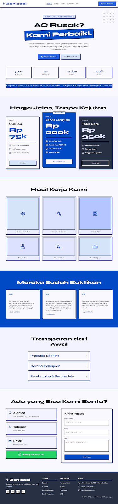

# ❄️ CV-Zen-Cool

<div align="center">
  
https://res.cloudinary.com/dr5pehdsw/image/upload/v1780475590/Halaman_Utama_zencool_miwc49.png


[](https://github.com/AlBasyaar/CV-Zen-Cool/stargazers)

[](https://github.com/AlBasyaar/CV-Zen-Cool/network)

[](https://github.com/AlBasyaar/CV-Zen-Cool/issues)

[](LICENSE) <!-- License file not detected -->

**A modern, AI-powered CV builder designed for clarity, impact, and a seamless user experience.**

[Live Demo](https://demo-link.com) <!-- TODO: Add live demo link --> |
[Design Document](DESIGN.md) |
[AI Agents Overview](AGENTS.md)

</div>

## 📖 Overview

CV-Zen-Cool is an innovative web application aimed at simplifying the resume creation process. Leveraging the power of Next.js and Tailwind CSS, it provides a clean, intuitive interface for users to build professional-grade curricula vitae. A key differentiator of this project is its anticipated integration with advanced AI agents, such as Claude, to assist users with content generation, optimization, and personalized feedback, ensuring their CVs stand out. This project emphasizes a "zen" approach to CV building — making it calm, efficient, and effective.

## ✨ Features

- 🤖 **AI-Powered Content Assistance**: Intelligent suggestions and generation for resume sections leveraging large language models (e.g., Claude).
- 🎨 **Modern & Responsive UI**: Built with Next.js and Tailwind CSS for a beautiful, adaptable, and user-friendly experience across devices.
- ✏️ **Intuitive Editor**: A streamlined interface for easily adding, editing, and organizing CV sections.
- 👁️ **Real-time Preview**: Instantly see changes reflect on your CV as you build it.
- 📄 **Customizable Templates**: Choose from a selection of clean, professional templates to match your style (inferred).
- 📥 **Export Functionality**: Download your perfected CV in standard formats like PDF (inferred).

## 🖥️ Screenshots

 

## 🛠️ Tech Stack

**Frontend:**


**Tools & Other:**


## 🚀 Quick Start

Follow these steps to get CV-Zen-Cool up and running on your local machine.

### Prerequisites
-   **Node.js**: Version 20 or higher (recommended by Next.js 14).
    You can download it from [nodejs.org](https://nodejs.org/).
-   **npm**: Comes bundled with Node.js.

### Installation

1.  **Clone the repository**
    ```bash
    git clone https://github.com/AlBasyaar/CV-Zen-Cool.git
    cd CV-Zen-Cool
    ```

2.  **Install dependencies**
    ```bash
    npm install
    ```

3.  **Environment setup**
    This project may require environment variables for AI service API keys (e.g., for Claude).
    Create a `.env` file in the root directory:
    ```bash
    cp .env.example .env # TODO: Create a .env.example file if not present in the repo
    ```
    Then, populate it with necessary values:
    ```
    # Example:
    # CLAUDE_API_KEY=your_claude_api_key_here
    ```

4.  **Start development server**
    ```bash
    npm run dev
    ```

5.  **Open your browser**
    Visit `http://localhost:3000` (or the port indicated in your console).

## 📁 Project Structure

```
CV-Zen-Cool/
├── .gitignore         # Specifies intentionally untracked files to ignore
├── AGENTS.md          # Documentation regarding AI agents and their integration
├── CLAUDE.md          # Specific documentation related to Claude AI
├── DESIGN.md          # Comprehensive design document for the application
├── README.md          # Project README file
├── app/               # Next.js App Router root for pages, layouts, and API routes
│   └── ...            # (Contains page.tsx, layout.tsx, potentially api/ routes)
├── eslint.config.mjs  # ESLint configuration for code linting
├── next.config.ts     # Next.js configuration file
├── package-lock.json  # Records exact dependency versions
├── package.json       # Project dependencies and scripts
├── postcss.config.mjs # PostCSS configuration (used by Tailwind CSS)
├── public/            # Static assets (e.g., images, favicons)
├── screen.png         # Main screenshot for the README
└── tsconfig.json      # TypeScript configuration
```

## ⚙️ Configuration

### Environment Variables
Environment variables can be configured in a `.env` file in the project root.

| Variable | Description | Default | Required |

|----------|-------------|---------|----------|

| `CLAUDE_API_KEY` | Your API key for the Claude AI service. | None | Yes (for AI features) |

| `NEXT_PUBLIC_VERCEL_URL` | Vercel deployment URL (auto-set in Vercel). | `http://localhost:3000` | No |

| `NEXT_PUBLIC_APP_ENV` | Application environment (e.g., `development`, `production`). | `development` | No |
<!-- TODO: Add any other detected environment variables from code analysis -->

### Configuration Files
-   `next.config.ts`: Main configuration for Next.js, including build options and potential image optimization.
-   `postcss.config.mjs`: Configures PostCSS plugins, notably for Tailwind CSS.
-   `eslint.config.mjs`: Defines code linting rules to ensure code quality and consistency.
-   `tsconfig.json`: TypeScript compiler options for the project.

## 🔧 Development

### Available Scripts
In the project directory, you can run:

| Command | Description |

|---------|-------------|

| `npm run dev`   | Runs the app in development mode at `http://localhost:3000`. |

| `npm run build` | Builds the application for production to the `.next` folder. |

| `npm run start` | Starts the production-built application. |

| `npm run lint`  | Runs ESLint to check for code quality and style issues. |

### Development Workflow
1.  Ensure all prerequisites are installed.
2.  Install dependencies using `npm install`.
3.  Start the development server with `npm run dev`.
4.  Develop components and pages within the `app/` directory. Next.js provides hot-reloading for a smooth development experience.
5.  Check code style and catch potential errors using `npm run lint` regularly.

## 🧪 Testing

This project uses ESLint for code linting to maintain code quality.
```bash

# Run lint checks
npm run lint
```
<!-- TODO: If unit/integration testing framework like Jest, React Testing Library, or Cypress is added, update this section with relevant commands and details. -->

## 🚀 Deployment

### Production Build
To create an optimized production build:
```bash
npm run build
```
This command compiles and bundles the application for optimal performance. The output is generated in the `.next` directory.

### Deployment Options
This Next.js application can be easily deployed to various platforms:
-   **Vercel**: The fastest way to deploy Next.js applications. Connect your GitHub repository, and Vercel will automatically build and deploy.
-   **Self-Hosting**: The `npm run start` command can be used to serve the production build on any Node.js compatible environment.

## 🤝 Contributing

We welcome contributions to CV-Zen-Cool! To contribute:

1.  Fork the repository.
2.  Create a new branch (`git checkout -b feature/your-feature-name`).
3.  Make your changes.
4.  Ensure your code adheres to the ESLint standards (`npm run lint`).
5.  Commit your changes (`git commit -m 'feat: Add new feature'`).
6.  Push to the branch (`git push origin feature/your-feature-name`).
7.  Open a Pull Request.

Please refer to `DESIGN.md`, `AGENTS.md`, and `CLAUDE.md` for more context on the project's vision and AI integration.

### Development Setup for Contributors
Follow the [Quick Start](#🚀-quick-start) guide to set up your development environment.

## 📄 License

This project is licensed under [Pending License] - see the [LICENSE](LICENSE) file for details. <!-- TODO: Add a LICENSE file (e.g., MIT, Apache 2.0) to the repository. -->

## 🙏 Acknowledgments

-   Built with [Next.js](https://nextjs.org/) for a powerful React framework.
-   Styled using [Tailwind CSS](https://tailwindcss.com/) for utility-first styling.
-   Code quality enforced with [ESLint](https://eslint.org/).
-   Leveraging [TypeScript](https://www.typescriptlang.org/) for robust and scalable code.
-   Special thanks to the open-source community for providing invaluable tools and libraries.

## 📞 Support & Contact

-   🐛 Issues: [GitHub Issues](https://github.com/AlBasyaar/CV-Zen-Cool/issues)
-   Feel free to reach out to [AlBasyaar](https://github.com/AlBasyaar) for questions or discussions.

---

<div align="center">

**⭐ Star this repo if you find it helpful!**

Made with ❤️ by [AlBasyaar](https://github.com/AlBasyaar)

</div>
```

